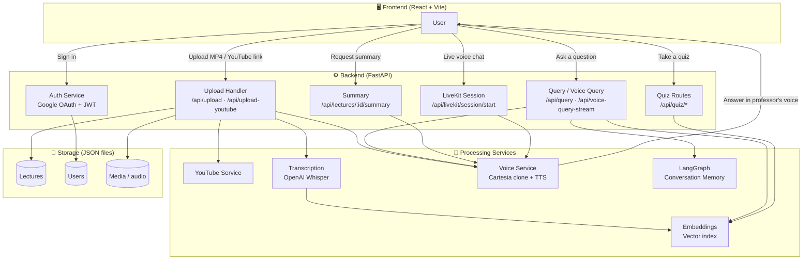

# EduVoice AI — Vibecon Education Platform

AI-powered learning platform with voice cloning, lecture transcription, and interactive tutoring.

> Repository: `Vibecon-Education-Platform` · Application name: **EduVoice AI**

## 🎯 Features

- **Lecture Upload**: MP4 video and YouTube video support
- **Voice Cloning**: Clone professor's voice using Cartesia AI
- **Transcription**: Automatic speech-to-text with OpenAI Whisper
- **AI Tutoring**: Ask questions and get answers in the professor's voice
- **Quizzes**: Auto-generated quizzes with voice questions and feedback
- **Lecture Summaries**: AI-generated summaries with audio
- **Conversation Memory**: LangGraph-based memory (V1/V2 toggle)
- **Real-time Voice**: LiveKit-powered live voice sessions
- **Google Authentication**: Secure sign-in with Google OAuth

## 🔄 How It Works



**Lecture pipeline:** Upload (MP4 or YouTube) → extract audio (ffmpeg) → transcribe (Whisper) → build embeddings → clone voice (Cartesia) → store as JSON.

**Q&A pipeline:** Question → semantic search over embeddings → LangGraph memory for context → generate answer → synthesize speech in the cloned voice.

## 📋 System Requirements

### ⚠️ CRITICAL: System Dependencies

**These are system-level binaries that MUST be installed separately:**

1. **ffmpeg** — required for audio/video processing (NOT in `requirements.txt`)
   ```bash
   # macOS
   brew install ffmpeg
   # Debian / Ubuntu
   sudo apt-get update && sudo apt-get install -y ffmpeg
   ```
2. **Python 3.11+**
3. **Node.js 20+** (npm; Yarn also works)
4. **MongoDB** (optional — currently using JSON file storage)

---

## 🚀 Local Development

Use this for running the project from a clone on your own machine.

### 1. Install system dependencies

```bash
# macOS
brew install ffmpeg
# Verify
ffmpeg -version
```

### 2. Backend (FastAPI)

```bash
cd backend
python -m venv .venv && source .venv/bin/activate
pip install -r requirements.txt

# Configure environment (see Environment Variables below)
cp .env.example .env   # or create backend/.env manually

# Run the API
python server.py
# API serves on http://localhost:8000
```

### 3. Frontend (React + Vite)

```bash
cd frontend
npm install      # or: yarn install
npm run dev      # or: yarn dev
# App serves on http://localhost:3000
```

### Environment Variables

**Backend** (`backend/.env`):
```env
# OpenAI API Key (REQUIRED)
OPENAI_API_KEY=sk-proj-your-key-here

# Cartesia API Key (REQUIRED for voice cloning)
CARTESIA_API_KEY=your-cartesia-key-here

# Google OAuth (REQUIRED for authentication)
GOOGLE_CLIENT_ID=your-client-id.apps.googleusercontent.com
GOOGLE_CLIENT_SECRET=GOCSPX-your-secret-here

# JWT Secret (auto-generated if omitted)
JWT_SECRET_KEY=your-secret-key-here
```

**Frontend** (`frontend/.env`):
```env
# Backend URL — point at your local API for local dev
REACT_APP_BACKEND_URL=http://localhost:8000

# Google OAuth Client ID
REACT_APP_GOOGLE_CLIENT_ID=your-client-id.apps.googleusercontent.com
```

> **Note on env var naming:** This is a Vite project, but `vite.config.js` deliberately exposes `REACT_APP_*` variables via `define` + `envPrefix` for compatibility. So the code reads `process.env.REACT_APP_*` — this is intentional, not a bug.

---

## ☁️ Hosted / Production Deployment

The hosted environment (Emergent) runs from `/app` and is managed by supervisor.

```bash
# Setup script (hosted container)
chmod +x /app/scripts/setup_system.sh
/app/scripts/setup_system.sh

# Start / restart all services
sudo supervisorctl restart all
sudo supervisorctl status
```

In the hosted setup, env files live at `/app/backend/.env` and `/app/frontend/.env`, and `REACT_APP_BACKEND_URL` points at the production preview domain. See `DEPLOYMENT.md` for full details.

## ⚠️ Common Issues

### 1. ffmpeg Not Found ⚠️ MOST COMMON
**Error**: `Audio extraction failed: [Errno 2] No such file or directory: 'ffmpeg'`

**Why**: ffmpeg is a system binary, NOT in `requirements.txt`.

**Solution**: install ffmpeg (see above), then restart the backend.

### 2. Google OAuth `redirect_uri_mismatch`
**Cause**: Redirect URI not configured in Google Cloud Console.

**Solution**: Add your domain (e.g. `http://localhost:3000`) to "Authorized redirect URIs" in Google Cloud Console.

### 3. White Screen on Frontend
**Cause**: Vite environment variable issues.

**Solution**: Variables must use the `REACT_APP_*` prefix and be read as `process.env.REACT_APP_*` (configured in `vite.config.js`).

## 🔧 Technology Stack

- **Backend**: FastAPI, Python 3.11
- **Frontend**: React 18, Vite 5, MUI, Framer Motion
- **Database**: JSON file storage
- **AI**: OpenAI (GPT-4o, Whisper, Embeddings), Cartesia (Voice)
- **Real-time**: LiveKit
- **Memory**: LangGraph
- **Auth**: Google OAuth 2.0, JWT

## 📁 Data Storage

- **Lectures**: `data/lectures/` (JSON files)
- **Users**: `data/users/` (JSON files)
- **Media**: `data/uploads/` (audio, video, voice clips)

> Hosted paths are under `/app/data/...`.

## 🔒 Security

- API keys belong in `.env` files (never commit them).
- JWT tokens for sessions (7-day expiry).
- User data isolation; demo lectures are read-only.

> ⚠️ Note: `vite.config.js` currently ships fallback defaults for `REACT_APP_BACKEND_URL` and `REACT_APP_GOOGLE_CLIENT_ID`. Override these via `.env` for your own deployment.

## 📝 License

See [LICENSE](LICENSE).
